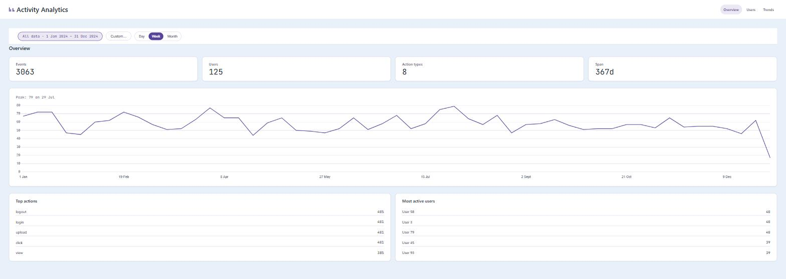

# User Activity Log Analytics Platform

Full-stack app that fetches `activities.csv` from a CDN URL, indexes it in memory,
and serves a dataset-level overview, per-user summaries, cross-user action trends,
sessions, and anomaly detection. Originally built for the Plank AI Accelerator
2-hour programming test; now in a second, unhurried phase hardening that MVP into a
tested, multi-screen product (see "Evolution" below and
[docs/roadmap.md](docs/roadmap.md)).



- `backend/` — Node.js + TypeScript + Express REST API, in-memory store, no database.
- `frontend/` — React + TypeScript (Vite) UI, three routed screens (react-router):
  - **Overview** (`/`) — dataset-level totals, an activity-over-time chart, top
    actions and most-active users. No input required; opens with an answer.
  - **Users** (`/users?user_id=`) — a searchable master list (with per-user activity
    sparklines) and a detail pane with a summary tile row and Sessions/Anomalies
    tabs. This *is* the user picker — no more OS `<datalist>` popup.
  - **Trends** (`/trends`) — the one genuinely cross-user view, a Chart.js bar chart
    of top `(user_id, action)` pairs with drill-down links into Users.

  `/summary`, `/sessions`, `/anomalies` redirect into `/users`, preserving the query
  string (and setting `?tab=`), so links shared before Phase 8 still resolve.

  A shared top filter bar (range chip + a `Custom…` popover whose date inputs are
  clamped to the dataset's actual bounds) replaces the old per-screen filter rail.
  Filters live in the URL, so a screen's URL is shareable/reloadable, survives the
  back button, and paginated views carry `page`/`page_size` the same way. Styled
  from the design-token palette in [docs/design.md](docs/design.md) — every color,
  type size, and spacing value in the CSS traces back to that doc, including its
  Phase 8 amendments (a self-hosted data monospace, the top filter bar). The
  Sessions tab adds a horizontal timeline strip above its table: each session is a
  bar positioned at its real start with width proportional to its own span, on an
  axis that stays fixed as you paginate (see "API" below).
- `shared/` — `activity-analytics-shared-types`, a `file:`-dependency package
  holding the API response interfaces (`UserSummary`, `TrendPair`, `Overview`,
  `Health`, `UserListEntry`, `SessionSummary`, `AnomalyEvent`, `Page<T>`) both
  packages import, so a field rename fails the other side's typecheck instead of
  silently drifting.
- `docs/data-source.md` — structural analysis of the real CSV (schema, value ranges,
  the unquoted-JSON parsing edge case).
- `docs/design.md` — the design direction: palette, type scale, spacing, layout,
  and copy, with Phase 8's amendments recorded inline. Every CSS decision traces
  back to it.
- `docs/tasks-mvp.md` — the original 2-hour build's task breakdown, frozen as a
  historical record.
- `docs/roadmap.md` — the hardening phases this repo is currently worked against.

## Setup & run

Requires Node.js 18+ (uses the built-in `fetch`).

**Backend** (starts on `http://localhost:4000` by default, fetches the CSV on startup):
```bash
cd backend
npm install
npm run dev
```
Set `PORT` to run on a different port (e.g. `PORT=4100 npm run dev`). If you change
it, update `frontend/vite.config.ts`'s proxy targets to match — the frontend dev
server doesn't read `PORT` itself.

**Frontend** (starts on `http://localhost:5173`, proxies `/overview`, `/summary`,
`/action_trends`, `/sessions`, `/anomalies`, `/users`, `/health`, `/load` to the
backend — see `frontend/vite.config.ts`):
```bash
cd frontend
npm install
npm run dev
```

Open `http://localhost:5173`. If the backend's startup fetch failed (e.g. no network
at boot), `POST http://localhost:4000/load` retries it; until a load succeeds, the
other endpoints return `503`.

## Testing

```bash
cd backend && npm test    # vitest: unit + supertest integration, fixture CSV, no network
cd frontend && npm test   # vitest: useQuery, useUrlFilters, validation — component
                           # logic extracted into testable hooks/units (Phase 4)
```

## API

- `GET /overview?start_time=<ISO8601>&end_time=<ISO8601>&bucket=day|week|month` —
  describes the dataset (or a time slice of it) rather than one user; the only
  endpoint with no `user_id`. All params optional; `bucket` defaults to `week`.
  Response:
  ```jsonc
  {
    "total_events": 3063,
    "total_users": 125,
    "distinct_actions": 8,
    "range_start": "2024-01-01T00:19:29Z",   // null when the range is empty
    "range_end":   "2024-12-31T17:03:44Z",
    "bucket": "week",
    "activity":    [{ "bucket_start": "2024-01-01T00:00:00Z", "count": 12 }],
    "top_actions": [{ "action": "login", "count": 531 }],
    "top_users":   [{ "user_id": 3, "count": 40 }]
  }
  ```
  `400` on an invalid timestamp, an inverted range, or an unrecognised `bucket`.
  `503` before any successful load. **`200` on an empty range** (zeros, an empty
  `activity` array, null range bounds) rather than `404` — an empty window is a
  correct answer about a dataset, not a missing resource (see CLAUDE.md §4).
  `activity`'s buckets are UTC-aligned (day → midnight, week → the preceding
  Monday, month → the 1st) and span every bucket from the first to the last event
  in range, including empty ones — the series never skips a silent period.
  `top_actions`/`top_users` are capped at 5, ties broken by first-seen order.
- `GET /summary?user_id=<int>&start_time=<ISO8601>&end_time=<ISO8601>` — `user_id`
  required, times optional. `400` on bad/missing params or `start_time > end_time`;
  `404` if the user has no matching rows.
- `GET /action_trends?start_time=<ISO8601>&end_time=<ISO8601>&limit=<int>` — all
  optional; top `(user_id, action)` pairs by count in range. `limit` defaults to 3,
  `400` if not a positive integer, silently capped at 50.
- `GET /sessions?user_id=<int>&start_time=<ISO8601>&end_time=<ISO8601>&page=<int>&page_size=<int>`
  *(bonus)* — `user_id` required. Groups that user's events (after time filtering)
  into sessions wherever the gap since the previous action is ≤30 min; returns the
  paginated envelope `{ items: { start, end, actions, total_duration }[], page,
  page_size, total, total_pages, range_start, range_end }`. `page` defaults to 1,
  `page_size` to 20 (capped at 100); an out-of-range `page` returns `items: []` with
  accurate `total`/`total_pages`, not a `400`. `404` only if the user has no data at
  all — a known user with zero sessions *in range* returns `200` with `items: []`
  (and `range_start`/`range_end: null`), since an empty result is a normal answer
  for a list endpoint (see below). `range_start`/`range_end` are the first session's
  start and the last session's end across the *full* session list for the query, not
  just the current page — computed for free from the already-chronological list
  (no re-scan), so the frontend's timeline axis stays fixed as you paginate instead
  of rescaling to whatever's on the current page.
- `GET /anomalies?user_id=<int>&start_time=<ISO8601>&end_time=<ISO8601>&page=<int>&page_size=<int>`
  *(bonus)* — `user_id` required. Per `(user_id, action)` pair, flags durations more
  than 2 population-standard-deviations from that pair's mean; returns the **same
  paginated envelope as `/sessions`** (`items: { timestamp, action, duration }[]`,
  plus `page`/`page_size`/`total`/`total_pages`) — a deliberate consistency choice
  between the two sibling list endpoints, even though only `/sessions` strictly
  needed pagination. Same `200`-with-empty-`items` vs `404` semantics as `/sessions`.
- `GET /users` — every known `user_id` with its event count and a fixed-length
  activity sparkline, sorted ascending;
  `[{ user_id, count, activity: number[] }]` (24 buckets, `USER_SPARKLINE_BUCKETS`).
  Powers the Users screen's searchable list. `activity` spans the **dataset's**
  bounds, not the current filter, so a user's shape stays recognisable as the range
  changes — it's a navigation aid, not a filtered chart.
- `GET /health` — `{ loaded, total_lines, rows_loaded, rows_skipped, skipped_reasons,
  dataset_start, dataset_end }`. The one endpoint that does **not** 503 before a
  successful load — reporting `loaded: false` (with every other field `null`) is its
  normal, expected response in that state, not an error. `dataset_start`/
  `dataset_end` are the whole dataset's bounds, computed once per load and
  filter-independent — the frontend uses them to clamp the custom-range date
  inputs. Not interchangeable with `/overview`'s `range_start`/`range_end`, which
  describe the current filtered slice and shrink as you filter.
- `POST /load` — re-fetch and re-parse the CSV, replacing the in-memory store on
  success only (a failed reload keeps serving the last good data).

**Why `/summary` and `/action_trends` don't use the envelope:** the paginated
`{ items, page, page_size, total, total_pages }` shape only exists on endpoints
that are actually paginated. `/summary` returns a single object, not a list, so
there's nothing to paginate. `/action_trends` returns a list too, but it's
already bounded by `limit` (default 3, capped at 50) rather than paginated —
a top-N ranking, not a browsable result set. This asymmetry (2 endpoints
enveloped, 2 not) is deliberate, not an oversight.

## Data structures & optimization approach

The CSV is parsed once (at startup / on `/load`), not on every request. The parsed
store (`backend/src/store.ts`) is a `Map<user_id, ActivityEvent[]>`, with each user's
events kept sorted ascending by timestamp:

- `/summary`, `/sessions`, and `/anomalies` all need one user's events in time order —
  that's an `O(1)` map lookup, then an `O(log n)` binary search to find the start/end
  of a `start_time`/`end_time` window (no full re-scan of that user's rows per
  request). Sessions and per-action anomaly stats are then computed with a single
  linear pass over that already-narrow slice.
- `/action_trends` needs every user's events — the handler iterates the map's
  per-user buckets (one binary-search slice per user), tallies `(user_id, action)`
  counts, then sorts. At ≤5000 rows / ≤125 users this is well under the 1-second
  budget (measured: all four endpoints respond in well under 50ms against the live
  3,063-row CSV).

Tie-breaking (most-frequent action/page, top-3 trends) is made deterministic by
relying on `Map`/array insertion order: events are inserted in first-CSV-appearance
(user) then chronological (per-user) order, and JS `Map` iteration and
`Array.prototype.sort` are both stable — so equal counts consistently resolve to the
earliest-occurring key rather than incidental hash-order.

### The CSV's real parsing hazard

`docs/data-source.md` documents the full analysis, but the one thing that would have
broken a naive implementation: the `metadata` column is **unquoted JSON containing
commas** (e.g. `72,2024-01-04T05:20:04Z,logout,{"page": "dashboard", "duration": 107}`).
A plain `line.split(',')`, or a CSV library configured for standard RFC 4180 quoting,
shreds this into 5+ fields. `backend/src/csvParser.ts` splits each line on only its
first 3 commas and treats everything after as the raw metadata JSON string — verified
against all 3,063 real rows with zero parse failures.

Rows that fail validation (bad `user_id`/timestamp/JSON, wrong column count) are
skipped individually and counted/sampled for diagnostics, rather than failing the
whole load — only a structurally wrong header (missing/renamed columns) aborts the
parse entirely.
